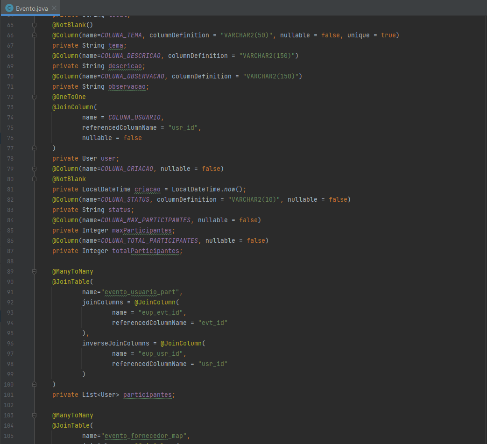
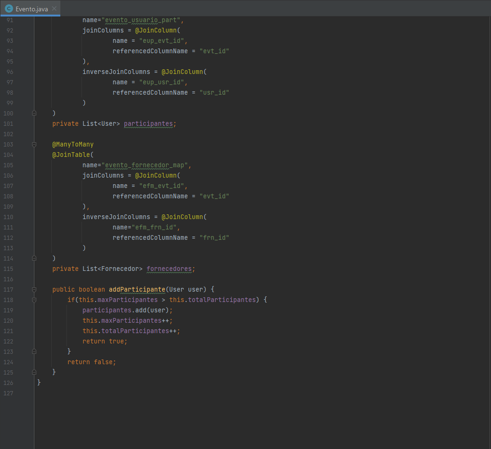

# Endurance (API - Fatec sjc)

## Descrição
O sistema Endurance tem como objetivo principal o gerenciamento de eventos, possibilitando a criação e o controle aos colaboradores da empresa. O público externo poderá ser cadastrado no sistema para participar dos eventos, seguindo as restrições sanitárias devido a pandemia e a validação do comprovante de vacinação contra SARS-CoV-2, tanto para dose única quanto para demais doses. Os usuários cadastrados serão notificados sobre novos eventos e atualizações via e-mail.

## Tecnologias
[Spring Boot](https://spring.io/projects/spring-boot)
- Devido ao grande número de materiais disponíveis na internet, adequação ao padrão de projeto MVC e conhecimento prévio o framework Spring Boot foi decisão unânime do grupo.
  
[Angular](https://angular.io/cli)
- Foi escolhido também pela grande quantidade de materiais de estudo na internet, fácil integração com o framework Spring Boot e conhecimento prévio. 
  
[Oracle](https://www.oracle.com/br/database/)
- Escolha natural visto que o cliente é a própria Oracle.


## Contribuições
Fiquei encarregado de todo o back end do projeto e, mais tarde, da criação do banco de dados. A arquitetura que eu escolhi foi a MVC, pois, apesar de ser uma arquitetura mais antiga, ainda é muito utilizada no mercado de trabalho - pois funciona! -, desso modo trazendo um aprendizado efetivo para o meu desenvolvimento, adequa-se muito bem às soluções propostas para o problema e requer menos *resources* da parte do estudante - em uma arquitetura de micro serviços por exemplo seria difícil encontrar uma maneira de hospedar pelos menos 5 end-points sem pagar nada - pois, sendo estruturada de maneira monolitica, requer apenas uma hospedagem.

##### Arquitetura MVC

- Uma visão geral da arquitetura do programa. Já que na parte **View** foi utilizado um framework de frontend (Angular) o backend ficou encarregado da parte Model e Controller e outros pacotes interessantes para o projeto como exception para um melhor controle do fluxo do programa e constant para deixar o código mais legível.

###### Model



- Um exemplo de uma das 3 entidades do programa, podemos ver a utilização da biblioteca Lombok para simplificar e manter o código mais legível eliminando código **boilerplate** (código recorrente como getters e setters), também podemos observar a utilização do framework Hibernate sendo utilizado no seu modelo JPA para deixar mais simples a comunicação entre o banco de dados e o Model. E na imagem 2 e 3 temos um exemplo do mapeamento das diferentes entidades, OneToOne (1-1) no caso referindo-se a um Evento sendo criado por um Usuário e ManyToMany (N-N) sendo uma lista de participantes para esse Evento. As outras 2 entidades seguem esse mesmo modelo de organização.
<hr>

- Um exemplo de uma interface de service, segui um modelo muito utilizado no mercado de trabalho que é dividir a camada service, onde fica a lógica e regras de negócio do programa, entre interface e implementação para uma melhor organização e reaproveitamento do código. A interface possui a lógica geral que o programa deve seguir.
<hr>


- Um exemplo de uma implementação da service interface (serviceImpl), é nessa camada que eu coloquei as regras de negócio como horário de funcionamento da casa Oracle, sugestão de horário, a possibilidade do usuário Oracle (colaborador da empresa) poder cadastrar um evento e o envio de emails para os usuários.
<hr>

- Service criado para o envio de emails.
<hr>


- Um dos principais requisitos do sistema era o upload da foto da carteira de vacinação para SARSCoV2. Nas imagens pode ser notado que utilizei o computador como um servidor para gravar as imagens em um local pré-definido.
<hr>

- Um exemplo de repository. Podemos notar a criação de uma query nativa para buscar na tabela de mapeamento entre Fornecedores e Eventos todos os fornecimentos que um Fornecedor está disponibilizando, assim otimizando o sistema - não fazendo necessário um mapeamento direto na classe de Fornecedores.
<hr>

- Todas as exceções criadas até o momento para o programa. Um ótimo jeito para controlar regras de negócio.
<hr>
###### DDL
```
------------------------------------------
-- USUARIOS
------------------------------------------
CREATE TABLE USUARIOS (
  USR_ID NUMBER(38, 0) GENERATED BY DEFAULT AS IDENTITY NOT NULL,
  USR_NOME VARCHAR2(25) NOT NULL,
  USR_SOBRENOME VARCHAR2(100) NOT NULL,
  USR_CPF VARCHAR2(11) NOT NULL,
  USR_EMAIL VARCHAR2(255) NOT NULL,
  USR_SENHA VARCHAR2(255) NOT NULL,
  USR_IMAGEM VARCHAR2(255),
  USR_VACINA VARCHAR2(255),
  USR_ULTIMO_ACESSO TIMESTAMP,
  USR_ULTIMO_ACESSO_DISPLAY TIMESTAMP,
  USR_DATA_CADASTRO TIMESTAMP,
  USR_TIPO VARCHAR2(25) NOT NULL,
  USR_AUTORIDADES RAW,
  USR_ATIVO NUMBER(1),
  USR_NAO_BLOQUEADO NUMBER(1),
  CONSTRAINT PK_USUARIOS PRIMARY KEY (USR_ID)
);

ALTER TABLE USUARIOS ADD CONSTRAINT UC_USUARIOS_USR_CPF UNIQUE (USR_CPF);

ALTER TABLE USUARIOS ADD CONSTRAINT UC_USUARIOS_USR_EMAIL UNIQUE (USR_EMAIL);

CREATE SEQUENCE  USER_SEQUENCE  MINVALUE 1 MAXVALUE 9999999999999999999999999999 INCREMENT BY 1 START WITH 1 CACHE 20 NOORDER  NOCYCLE  NOKEEP  NOSCALE  GLOBAL;


------------------------------------------
-- EVENTOS
------------------------------------------
CREATE TABLE EVENTOS (
  EVT_ID NUMBER(38, 0) GENERATED BY DEFAULT AS IDENTITY NOT NULL,
  EVT_INICIO TIMESTAMP NOT NULL,
  EVT_FIM TIMESTAMP NOT NULL,
  EVT_LOCAL VARCHAR2(9) NOT NULL,
  EVT_TEMA VARCHAR2(50) NOT NULL,
  EVT_DESC VARCHAR2(150),
  EVT_OBS VARCHAR2(150),
  EVT_USR_ID NUMBER(38, 0) NOT NULL,
  EVT_CRIACAO TIMESTAMP NOT NULL,
  EVT_STATUS VARCHAR2(10) NOT NULL,
  EVT_MAX_PART INTEGER NOT NULL,
  EVT_TOTAL_PART INTEGER NOT NULL,
  CONSTRAINT PK_EVENTOS PRIMARY KEY (EVT_ID)
);

ALTER TABLE EVENTOS ADD CONSTRAINT UC_EVENTOS_EVT_TEMA UNIQUE (EVT_TEMA);

ALTER TABLE EVENTOS ADD CONSTRAINT FK_EVENTOS_ON_EVT_USR FOREIGN KEY (EVT_USR_ID) REFERENCES USUARIOS (USR_ID);

CREATE SEQUENCE  EVENTOS_SEQUENCE  MINVALUE 1 MAXVALUE 9999999999999999999999999999 INCREMENT BY 1 START WITH 1 CACHE 20 NOORDER  NOCYCLE  NOKEEP  NOSCALE  GLOBAL ;

------------------------------------------
-- EVENTOS+USUARIOS
------------------------------------------

CREATE TABLE EVENTO_USUARIO_PART (	
	EUP_EVT_ID NUMBER(19,0) NOT NULL, 
	EUP_USR_ID NUMBER(19,0) NOT NULL
   );

ALTER TABLE EVENTO_USUARIO_PART ADD CONSTRAINT FK_EVENTO_USUARIO_PART_USR_ID" FOREIGN KEY (EUP_USR_ID)
	  REFERENCES USUARIOS (USR_ID);

ALTER TABLE EVENTO_USUARIO_PART ADD CONSTRAINT FK_EVENTO_USUARIO_PART_EVT_ID FOREIGN KEY (EUP_EVT_ID)
	  REFERENCES EVENTOS (EVT_ID);


------------------------------------------
		FORNECEDORES
------------------------------------------
CREATE TABLE FORNECEDORES (
  FRN_ID NUMBER(38, 0) GENERATED BY DEFAULT AS IDENTITY NOT NULL,
  FRN_DESCRICAO VARCHAR2(25) NOT NULL,
  FRN_CNPJ VARCHAR2(14) NOT NULL,
  FRN_EMAIL VARCHAR2(100) NOT NULL,
  FRN_OBS VARCHAR2(255),
  CONSTRAINT PK_FORNECEDORES PRIMARY KEY (FRN_ID)
);

ALTER TABLE FORNECEDORES ADD CONSTRAINT UC_FORNECEDORES_FRN_CNPJ UNIQUE (FRN_CNPJ);

ALTER TABLE FORNECEDORES ADD CONSTRAINT UC_FORNECEDORES_FRN_DESCRICAO UNIQUE (FRN_DESCRICAO);

ALTER TABLE FORNECEDORES ADD CONSTRAINT UC_FORNECEDORES_FRN_EMAIL UNIQUE (FRN_EMAIL);

CREATE SEQUENCE  FORNECEDORES_SEQUENCE  MINVALUE 1 MAXVALUE 9999999999999999999999999999 INCREMENT BY 1 START WITH 1 CACHE 20 NOORDER  NOCYCLE  NOKEEP  NOSCALE  GLOBAL ;


------------------------------------------
	    EVENTOS+FORNECEDORES
------------------------------------------

CREATE TABLE EVENTO_FORNECEDOR_MAP (	
	EFM_EVT_ID NUMBER(19,0) NOT NULL, 
	EFM_FRN_ID NUMBER(19,0) NOT NULL
   );

ALTER TABLE EVENTO_FORNECEDOR_MAP ADD CONSTRAINT FK_EVENTO_FORNECEDOR_MAP_FRN_ID FOREIGN KEY (EFM_FRN_ID)
	  REFERENCES FORNECEDORES (RN_ID);

ALTER TABLE EVENTO_FORNECEDOR_MAP ADD CONSTRAINT FK_EVENTO_FORNECEDOR_MAP_EVT_ID FOREIGN KEY (EFM_EVT_ID)
	  REFERENCES EVENTOS (EVT_ID);
```
- DDL criado para o banco do API.
